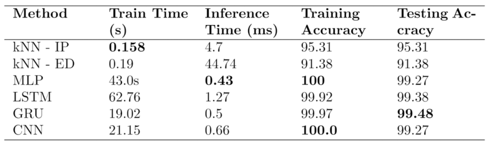

# Pattern Recognition Approaches for Gesture Classification
Final Project for EEL5825 in Fall 2021 by Mykola Maslych and Mostafa Aldilati

## Approaches
kNN, MLP, GRU, LSTM and CNN   

## Models
1. [KNN Approach](knn_approach.ipynb)
2. [Multilayer Perceptron](MLP_approach.ipynb)
3. [Gater Recurrent Units](GRU_Approach.ipynb)
4. [Long Short Term Memory](LSTM_approach.ipynb)
5. [Convolutional Neural Network](CNN_approach.ipynb)

## Performances Summary

### Dataset

We were not sure if we can upload the original data, so follow these steps to download it.   

1. Download XML files from [here](https://depts.washington.edu/acelab/proj/dollar/index.html) under _Unistroke gesture logs_   
   1. Unzip xml.zip   
   2. Delete the pilot user (s01)   
2. Run [convert.py](convert.py) to convert the XML to our format   
   *kNN, GRU and LSTM approaches will work now*   
3. Run all cells in [fully_connected_data_preparation.ipynb](fully_connected_data_preparation.ipynb)   
   *MLP approach will work now*
4. Run all cells in [dataset_to_bitmap.ipynb](dataset_to_bitmap.ipynb)   
5. Run all cells in [generate_dataset_images.ipynb](generate_dataset_images.ipynb)   
   *CNN approach will work now*